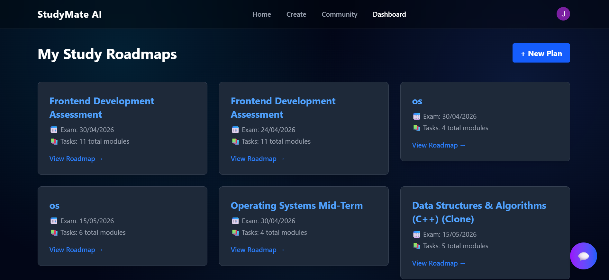
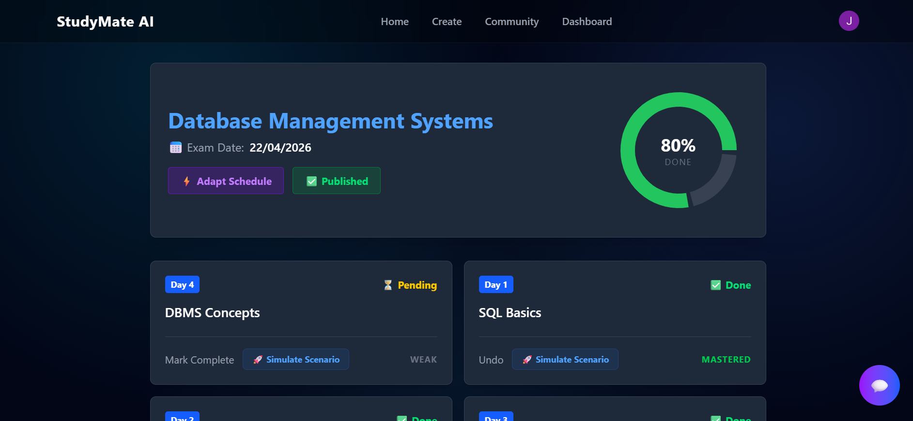
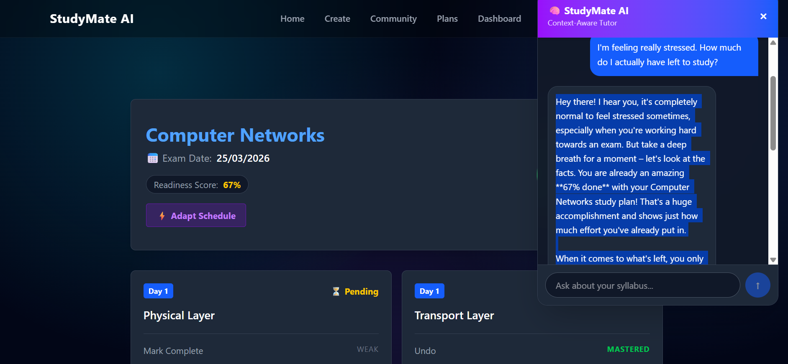
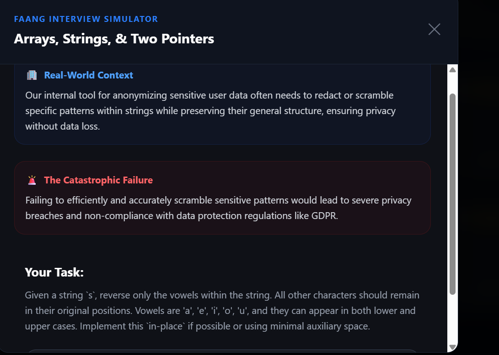
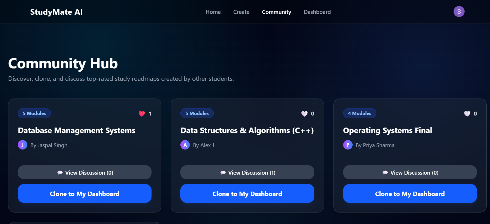

# 🧠 StudyMate AI — Adaptive AI Study Planning Engine

An enterprise-grade **PERN-stack AI academic strategist** that transforms unstructured syllabus data into **dynamic, adaptive, and context-aware study roadmaps**.

Unlike static planners or generic chatbots, StudyMate AI acts as an **intelligent system that adapts, guides, and evolves with the student’s progress**.

---

## ❤️ Why I Built This

As a student, I faced a recurring problem:

* I could create study plans… but I couldn’t **stick to them**
* Missing even one day would break the entire schedule
* Existing tools were either:

  * ❌ Static planners
  * ❌ Generic AI chatbots with no real context

### 💡 Insight

The real problem isn’t planning — it’s **adapting when things go wrong**.

---

## 🚀 What StudyMate AI Solves

* Converts raw syllabus → **structured day-wise roadmap**
* Dynamically **recalibrates plans when you fall behind**
* Provides a **context-aware AI mentor (not generic chatbot)**
* Enables **practical learning via real-world scenario simulation**

🎯 Result: **Consistent execution, reduced burnout, smarter preparation**

---

## ⚙️ Core System Features

### 🔁 Adaptive Scheduling Engine (Deterministic Recalibration)

* Custom **Round-Robin Scheduling Algorithm**
* Recomputes workload based on **remaining time**
* Fully handled by backend → avoids LLM hallucination

👉 Ensures:

* Predictability
* Data consistency
* Real-world reliability

---

### 🧠 Dual-Context AI Mentor (RAG-Based)

#### 1️⃣ Global Mentor (Dashboard Level)

* Understands:

  * All roadmaps
  * Overall progress
  * Upcoming deadlines
* Helps when:

  * User feels overwhelmed
  * Needs strategy or motivation

---

#### 2️⃣ Roadmap-Specific Mentor

* Operates inside a single roadmap
* Knows:

  * Completed tasks
  * Weak areas
* Provides:

  * Deep explanations
  * Tactical study strategy

👉 Built using **context injection + structured prompting with Gemini**

---

### ⚠️ General-Purpose Scenario Simulator

* Converts topics into **high-stakes real-world scenarios**
* Examples:

  * System failures
  * Exam pressure situations
* Forces **application of knowledge**, not just memorization

---

### 📊 Dashboard & Roadmap Experience

* Central dashboard:

  * View all created & cloned roadmaps
  * Track completion % visually
* Roadmap view:

  * Day-wise tasks
  * Status tracking (Done / Pending / Weak)
  * **Adaptive "Recalibrate" button**

---

### 🌐 Community Hub (Social Layer)

* Discover public roadmaps
* Clone into personal dashboard
* Engage via discussions

---

### 🔐 Security & Performance Engineering

* Clerk JWT authentication → **user-level isolation**
* Backend **rate limiting** → protects APIs & AI cost
* Frontend **cooldown/debouncing** → prevents spam calls
* Prisma ORM with PostgreSQL for scalable data handling

---

## 🏆 Key Highlights

* Architected a **PERN-stack AI system** for adaptive planning
* Built deterministic scheduling engine (non-LLM controlled)
* Designed **dual-context RAG-based AI mentor**
* Reduced API calls by **40% using debouncing**
* Implemented secure **JWT-based data isolation**
* Developed scalable full-stack architecture with real-world constraints

---

## 🛠️ Tech Stack

**Frontend**

* React.js (Vite)
* Tailwind CSS
* Recharts
* Clerk Auth

**Backend**

* Node.js
* Express.js
* TypeScript

**Database**

* PostgreSQL (Neon)
* Prisma ORM

**AI & Monitoring**

* Google Gemini 2.5 Flash API
* Sentry

---

## 📸 Project Showcase

### 📊 Dashboard — Centralized Study Control



---

### 🗺️ Adaptive Roadmap — Dynamic Task Execution



---

### 🧠 AI Mentor — Context-Aware Guidance



---

### ⚠️ Scenario Simulator — Real-World Problem Solving



---

### 🌐 Community Hub — Collaborative Learning



---

### 🧠 System Architecture

```
Frontend (React / Vite)
           │
           ▼  (REST API / JWT Auth)
           │
Backend (Node.js + Express + Prisma)  ◄──►  Sentry (Error Monitoring)
           │
           ├────────────────────────────┐
           ▼                            ▼
PostgreSQL (Neon DB)           Gemini API (AI Layer)
(Stores Roadmaps & Users)      (Generates Scenarios & Chats)
```

### 🔄 Data Flow Overview
1. User interacts with frontend dashboard
2. Requests are sent via REST APIs with JWT authentication
3. Backend processes logic:
   - Deterministic scheduling (no AI)
   - Fetches user progress from DB
4. AI calls (Gemini) are triggered only for:
   - Mentor responses
   - Scenario simulations
5. Results stored and served efficiently

---

## ⚙️ Setup Instructions

```bash
git clone https://github.com/your-username/studymate-ai.git
cd studymate-ai

# install dependencies
npm install

# setup env variables
VITE_API_URL=your_backend_url
DATABASE_URL=your_database_url
CLERK_SECRET_KEY=your_key
GEMINI_API_KEY=your_key

# run app
npm run dev
```

---

## 🔮 Future Enhancements

* 📅 Calendar integration
* 📊 Advanced analytics dashboard
* 🤝 Collaborative study groups
* 📱 Mobile app version

---

## 📬 Contact

Sourabh Kumar
GitHub: https://github.com/your-username

---

⭐ If you found this interesting, consider giving it a star!
